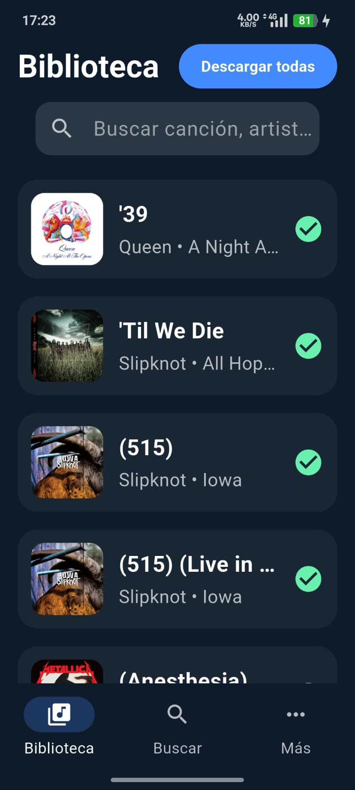
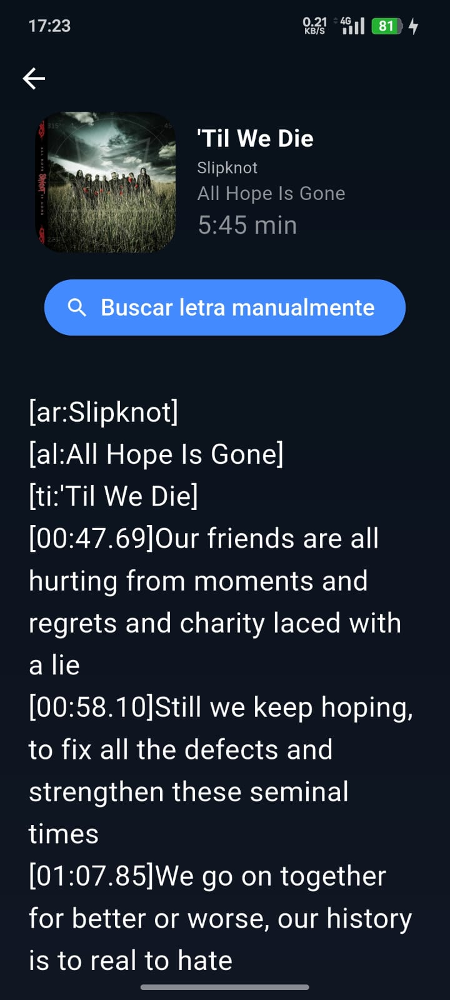
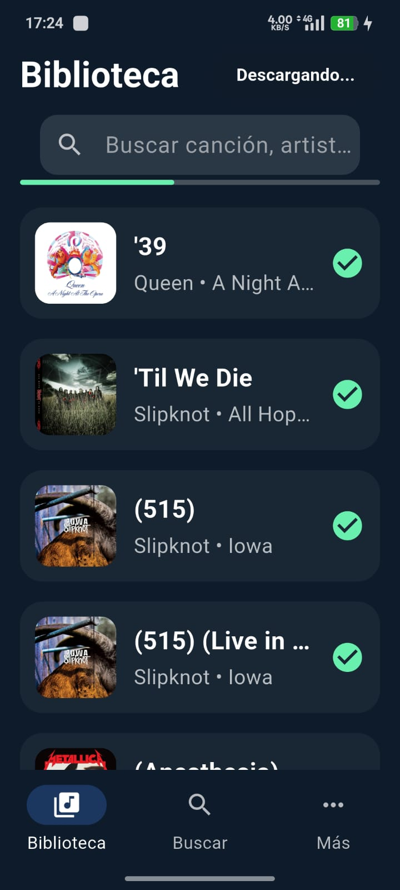
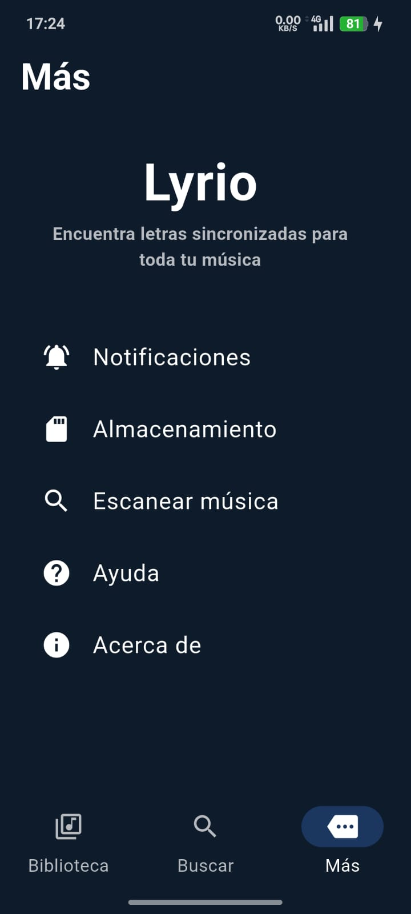

---

# 🎵 **TimeLyr — Buscador avanzado de letras para tu música local**

**TimeLyr** es una aplicación móvil desarrollada en **Flutter** que permite obtener, gestionar y visualizar letras de canciones almacenadas en tu dispositivo.
Analiza tus archivos locales, extrae sus metadatos y descarga letras sincronizadas (LRC) o en texto plano desde **LRCLib**, manteniendo siempre la privacidad del usuario.

---

## ✨ **Características principales**

* 🔍 **Detección automática de metadatos**
  Extrae título, artista, álbum y duración sin necesidad de internet.

* 🎼 **Compatibilidad completa con archivos LRC**
  Parser propio, soporte para timestamps y renderizado fluido.

* 📡 **Obtención de letras desde LRCLib API**
  Peticiones optimizadas según tus metadatos locales.

* 🚫 **Detección de canciones instrumentales**
  Si no se encuentra letra, TimeLyr lo marca automáticamente.

* 🖼️ **Caché inteligente de carátulas y datos**
  Velocidad mejorada para listas grandes.

---

## 🚀 **Tecnologías utilizadas**

| Componente  | Tecnología                       |
| ----------- | -------------------------------- |
| Framework   | Flutter (Dart 3)                 |
| API         | LRCLib                           |
| Metadatos   | metadata_god + servicios propios |
| Parsing LRC | Implementación personalizada     |
| UI          | Material 3 con temas propios     |
| Caché       | almacenamiento local optimizado  |

---

## 📦 **Estructura del proyecto**

```
lib/
├── main.dart
├── models
│   ├── lyric_result.dart
│   └── song.dart
├── screens
│   ├── home_screen.dart
│   ├── library_screen.dart
│   ├── lyric_preview_screen.dart
│   ├── lyrics_viewer.dart
│   ├── main_screen.dart
│   ├── more_screen.dart
│   ├── scan_screen.dart
│   └── search_screen.dart
├── services
│   ├── download_manager.dart
│   ├── file_service.dart
│   ├── local_notification_service.dart
│   ├── lrclib_service.dart
│   ├── lyrics_service.dart
│   └── notifications_settings.dart
├── theme
│   └── app_theme.dart
├── utils
│   ├── app_storage.dart
│   ├── artwork_cache.dart
│   ├── default_music_path.dart
│   ├── folder_picker.dart
│   ├── lyrics_utils.dart
│   ├── permissions.dart
│   ├── song_cache.dart
│   └── song_database.dart
└── widgets
    ├── gradient_background.dart
    ├── scan_music.dart
    ├── select_directory.dart
    ├── song_tile.dart
    └── toggleNotifications.dart
```

---

## 🧪 **Estado del proyecto**

TimeLyr actualmente soporta:

✔ escaneo de carpetas
✔ lectura de metadatos locales
✔ búsqueda automática de letras
✔ descarga y almacenamiento de LRC
✔ visualizador avanzado
✔ detección de canciones instrumentales
✔ caché de carátulas y canciones
✔ búsqueda manual
✔ configuración de notificaciones

Trabajos futuros sugeridos:

* 🎨 más temas personalizables
* 🧠 mejoras en el algoritmo de coincidencia con la API
* 🔔 mejor integración con notificaciones de sistema
* 🔍 buscador por filtros (álbum, género, año…)
* 🗃️ exportación/importación de letras y configuraciones

---

## 📥 **Instalación (Android)**

1. Descarga el APK desde **Releases**.
2. Instálalo en tu dispositivo Android.
3. Selecciona la carpeta donde guardas tu música.
4. TimeLyr analizará tus archivos y buscará letras automáticamente.

---

## 🧰 **Compilar desde código fuente**

Requisitos:

* Flutter SDK 3.19+
* Android SDK
* Dart 3.9+

```bash
git clone https://github.com/cvc953/timelyr.git
cd timelyr
flutter pub get
flutter build apk --release
```

---

## 🌐 **Cómo funciona TimeLyr internamente**

1. El usuario selecciona su carpeta de música.
2. TimeLyr escanea los archivos usando `permissions.dart` y `file_service.dart`.
3. Extrae metadatos con una implementación ligera.
4. Construye una petición óptima a LRCLib usando:

   * título
   * artista
   * álbum
   * duración
5. Obtiene letra sincronizada o no sincronizada.
6. Guarda la letra localmente (`download_manager.dart`).
7. Si no hay letra → marca la canción como instrumental.

---

## 🤝 **Contribuciones**

Las contribuciones son bienvenidas.
Puedes colaborar mediante:

* Pull requests
* Reporte de errores
* Sugerencias de funciones
* Correcciones de documentación

---

## 📄 Licencia

Este proyecto está licenciado bajo la **MIT License**.  
Puedes ver el archivo completo en [`LICENCIA`](LICENSE).

## 📸 **Capturas**

## 📚 Biblioteca



## 📝 Vista previa



## 🔍 Busqueda Manual


## 📥 Descarga masiva



## ⚙️ Más / Opciones  



---
